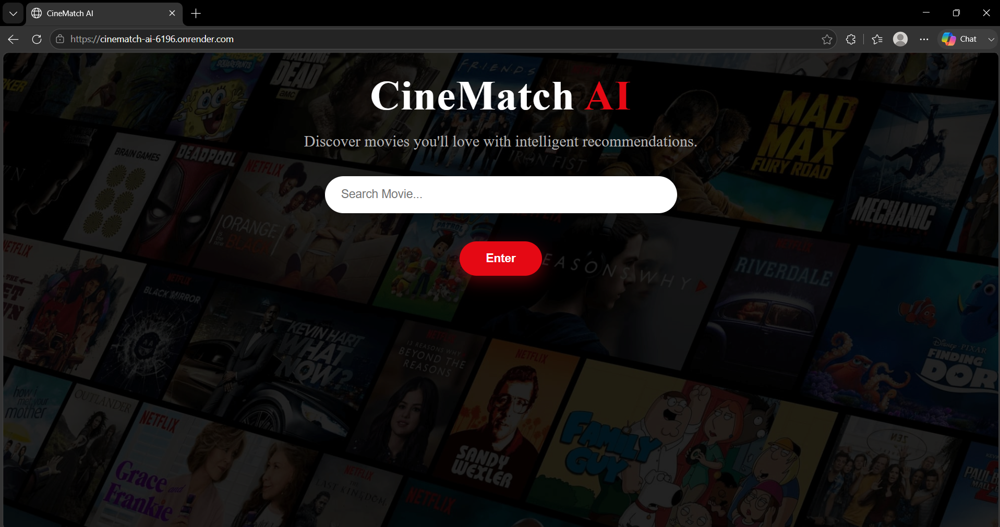
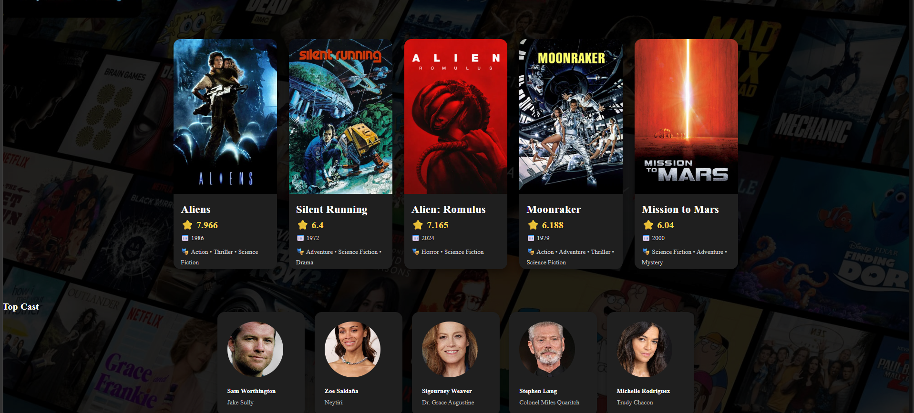

# 🎬 CineMatch AI

### ML-Powered Content-Based Movie Recommendation Platform

CineMatch AI is a machine learning-based movie recommendation web application that recommends movies based on content similarity. It analyzes movie metadata using NLP techniques and cosine similarity to identify similar movies, while integrating the TMDB API to provide real-time movie information, posters, ratings, and cast details.

## 🚀 Live Demo

**Try CineMatch AI:** https://cinematch-ai-6196.onrender.com/

> Note: The application is hosted on a free Render instance. The first request after a period of inactivity may take some time while the server starts.

---


## 📸 Screenshots

### Home Page



### Movie Recommendations



## ✨ Features

- 🎯 Content-based movie recommendation system
- 🧠 NLP-based movie feature processing
- 📐 Cosine similarity for finding similar movies
- 🔎 Fuzzy movie title matching using RapidFuzz
- 🎬 Top 5 movie recommendations
- 🖼️ Movie posters and metadata using TMDB API
- ⭐ Movie ratings
- 📅 Release year and runtime information
- 🎭 Genre information
- 👥 Top cast information
- ❌ Graceful handling of unavailable movies
- 📱 Responsive web interface
- ☁️ Deployed as a live web application

---

## 🧠 How It Works

CineMatch AI uses a content-based recommendation approach.

1. Movie metadata such as genres, keywords, cast, crew, and overview is collected and preprocessed.
2. Relevant features are combined into a unified textual representation called `tags`.
3. NLP preprocessing is applied to normalize the movie features.
4. `CountVectorizer` converts the textual movie features into numerical vectors.
5. Cosine similarity measures the similarity between movie vectors.
6. When a user searches for a movie, RapidFuzz helps match variations or misspellings of the title.
7. The system identifies the most similar movies and returns the top 5 recommendations.
8. The TMDB API dynamically retrieves posters, ratings, movie details, and cast information.

### Recommendation Pipeline

User Search  
↓  
Fuzzy Title Matching (RapidFuzz)  
↓  
Movie Identification  
↓  
Content-Based Recommendation Engine  
↓  
Cosine Similarity  
↓  
Top 5 Similar Movies  
↓  
TMDB API Enrichment  
↓  
Results Displayed through Flask Web Application

---

## 🛠️ Tech Stack

### Machine Learning & Data Processing
- Python
- Pandas
- NumPy
- Scikit-learn
- NLTK

### Recommendation System
- CountVectorizer
- Cosine Similarity
- RapidFuzz

### Backend
- Flask
- Gunicorn

### Frontend
- HTML
- CSS
- JavaScript

### External API
- TMDB API

### Deployment
- Render

---

## 📂 Project Structure

```text
cinematch-ai/
│
├── app.py
├── requirements.txt
├── README.md
├── .gitignore
│
├── artifacts/
│   ├── movies.pkl
│   └── similarity.pkl
│
├── dataset/
│
├── model/
│   ├── recommender.py
│   ├── tmdb.py
│   ├── preprocessing.py
│   └── nlp_utils.py
│
├── notebooks/
│   └── EDA.ipynb
│
├── static/
│   ├── css/
│   ├── js/
│   └── images/
│
└── templates/
    └── index.html
